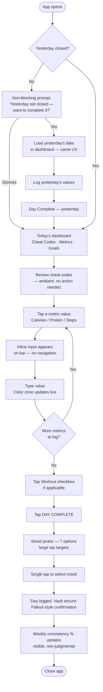
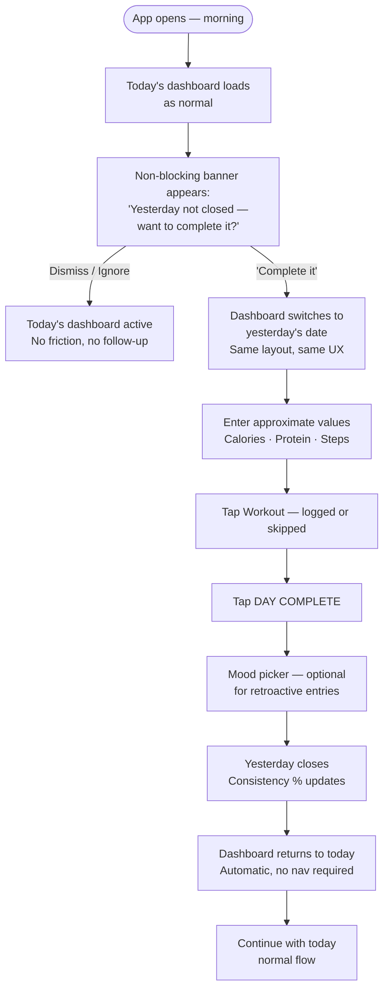
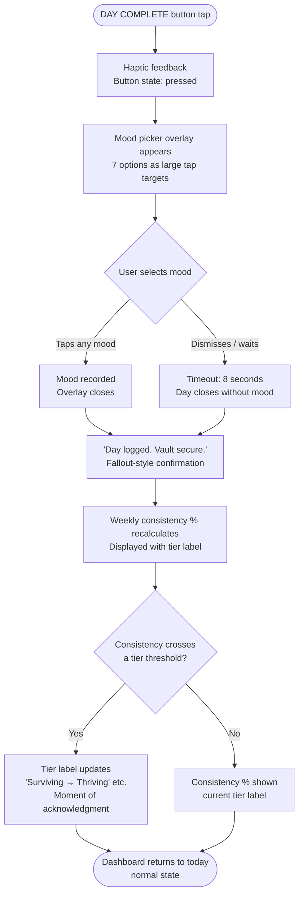
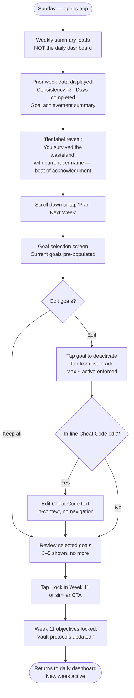

# UX Design Specification vault_1

**Author:** Developer
**Date:** 2026-03-08

---

<!-- UX design content will be appended sequentially through collaborative workflow steps -->

## Executive Summary

### Project Vision

Vault 1 is a personal health and habit system built around a single, radical inversion: for ADHD brains, clear data about failure drives avoidance — not motivation. Every UX decision flows from this premise. The app does not track failure. It tracks presence.

The product operates on two layers: **Win the Day** (daily execution via floor-based progress bars that render below-target performance as neutral, not failure) and **Build Your Character** (a Fallout-themed weekly gamification layer that rewards consistency at 60%+ and caps active focus to 3–5 goals). The UX holds these layers together through a design language where no color means "you failed," no streak can break, and a rough day is just data.

### Target Users

**Elizabeth** — the sole user and creator. Mid-30s, ADHD, desk job with 4:45am Mon–Wed workouts. Phone is her primary device. Food is logged retroactively in the 8–10am window (post-commute, at desk). Her hardest days are weekends — no structure, all-or-nothing thinking, unplanned eating. Her current system is a patchwork with no connective layer: Cronometer, Apple Watch, coaching texts, mental goals list.

Key UX implications:
- **Mobile-first, thumb-friendly** — she uses the app between focus sessions, at lunch, in brief windows
- **Low-friction logging** — she logs retroactively; the UX must accommodate approximate, after-the-fact entry without friction
- **Emotional safety is load-bearing** — the app must feel like relief after a hard day, not judgment
- **Cheat Codes must be ambient** — coaching strategies need to be visible without her having to seek them out; they're most useful when she's not thinking to look

### Key Design Challenges

1. **Shame-safe feedback at a glance** — progress bars must communicate "still in the game" even when targets are missed. Color, label language, and absence of red states must work together to prevent the avoidance trigger. The calorie bar is architecturally different from protein/steps (going over is a different signal), requiring an asymmetric color model without creating cognitive overhead.

2. **Dashboard density without overwhelm** — the daily view must simultaneously surface progress bars (up to 4), active goals (3–5), and Cheat Codes (up to 3) — all as first-class content. ADHD-aware design requires a single primary action per screen state and maximum 5 items in any primary area. This tension between completeness and cognitive load is the core dashboard UX challenge.

3. **Day Complete as ritual, not checklist** — the button must be accessible and feel right even when nothing went well. The ritual of closing a day (regardless of outcome) is the behavior the app is designed to enable. The UX must make this feel earned, not hollow.

### Design Opportunities

1. **Cheat Codes as ambient coaching infrastructure** — positioning coaching strategies as persistent, always-visible dashboard content (not a settings field or notes section) creates a genuinely novel UX pattern. The visual treatment of Cheat Codes is a primary design decision, not decoration.

2. **Tier label language as emotional register** — "Surviving the Wasteland" / "Thriving" / "Elite" can carry the entire tone of the app. These labels are not gamification flavor text — they are the primary feedback mechanism for weekly performance. Language is design.

3. **Sunday ritual as loot box, not homework** — the weekly planning screen has an opportunity to feel like opening rewards rather than doing a review. Prior-week summary, tier celebration, and next-week selection can be sequenced to build anticipation rather than dread — transforming the most resistance-prone touchpoint into the most satisfying one.

---

## Core User Experience

### Defining Experience

The defining experience of Vault 1 is the **daily check-in and Day Complete ritual** — a brief, low-friction interaction (target: under 60 seconds) that closes each day regardless of outcome. This is the load-bearing behavior the entire architecture exists to protect. Not tracking perfection. Not celebrating streaks. Closing the day, staying in the system, coming back tomorrow.

The secondary defining experience is the **Sunday planning ritual** — a weekly reset that should feel like opening a loot box, not doing homework. Prior-week data, a tier celebration, and next-week goal selection, sequenced to build anticipation rather than dread.

Everything else in the UX serves these two moments.

### Platform Strategy

- **Primary platform:** iOS Safari PWA, installed to home screen — behaves as near-native
- **Secondary:** Chrome mobile (Android), Chrome/Safari desktop for longer logging sessions
- **Input:** Touch-first; all interactive elements minimum 44×44px
- **Offline-first:** Core logging actions (calories, protein, steps, workout, Day Complete) must work with zero connectivity — essential for underground commute windows
- **Sync:** Local-first write, background sync to server, no user-facing wait states on core actions
- **Responsive range:** 320px–768px primary; readable (not optimized) at 1024px+

### Effortless Interactions

- **Retroactive logging** — entering yesterday's approximate numbers the next morning must feel natural, not like catching up. No penalty framing, no "you're late" signals.
- **Day Complete** — one tap, always accessible, never locked behind metrics. The button's availability is itself a design statement.
- **Cheat Codes at a glance** — coaching strategies must be readable without navigation, scroll, or intent. They are most useful when she isn't thinking to look for them.
- **Weekly planning** — pre-populated with last week's data, suggestions surfaced automatically, goal selection takes under 3 taps per goal. The 8-minute ceiling is a UX constraint, not just a product aspiration.

### Critical Success Moments

1. **The rough-day open** — she opens the app after a hard day expecting judgment. She sees amber (not red), sees 68% weekly consistency, and the Day Complete button is right there. This is the make-or-break moment for long-term retention. If the UX gets this wrong once, the spiral wins.

2. **First dashboard after onboarding** — it's already set up, it looks like a Vault-Tec terminal, and her goals are there. The identity hook lands at this moment. If it feels generic, the motivation to keep using it weakens immediately.

3. **Day Complete on a bad day** — she taps it when nothing went well. Something closes. There is acknowledgment without judgment. The log is recorded. This interaction must never feel hollow or punishing.

4. **Sunday under 10 minutes** — she closes the weekly planning screen and it didn't feel like work. This determines whether the ritual survives past week 2.

### Experience Principles

1. **Neutral is not failure** — no interaction, color, label, or copy should communicate failure for below-target performance. Amber is data. Orange is signal. Red does not exist.

2. **The app meets her where she is** — retroactive logging, late Day Complete, rough weeks: all are first-class states, not edge cases. The UX must be designed for the hardest moments, not the best ones.

3. **One primary action per screen state** — cognitive load is minimized at every view. The dashboard has a dominant next action. The planning screen has a clear sequence. Nothing competes for attention at the wrong moment.

4. **Coaching is infrastructure, not a feature** — Cheat Codes are not a widget or a notes field. They are ambient, always-present content, treated with the same visual weight as progress bars.

5. **Closure is the reward** — the Day Complete ritual, the weekly planning completion, the tier label reveal: each is a micro-ceremony. The UX should make closing feel satisfying, not just functional.

---

## Desired Emotional Response

### Primary Emotional Goals

**Primary goal: Relief.**

The most important emotional test for Vault 1 is not how it feels when things go well — it's how it feels when they don't. Opening the app after a rough day should produce relief: "I'm still in this." Not guilt. Not dread. Not the pre-emptive shame that causes the app to stay closed for three days.

Every visual, copy, and interaction decision is downstream of this single emotional requirement.

**Supporting emotional states:**
- **Calm ownership** — she is in control of her system; the system reports to her, not the other way around
- **Low-key momentum** — not high-energy "you can do it" motivation, but the quiet, sustainable satisfaction of showing up consistently over weeks
- **Identity resonance** — the Fallout / Vault-Tec aesthetic should feel genuinely hers; personalization isn't cosmetic, it's load-bearing for long-term engagement

### Emotional Journey Mapping

| Touchpoint | Target Emotion | Anti-emotion to Avoid |
|---|---|---|
| Opening after a rough day | Relief — "I'm still here, still in it" | Dread, shame, avoidance |
| Day Complete on a bad day | Quiet resolve — "Day closed, moving on" | Hollowness, "what's the point" |
| Seeing weekly consistency % + tier | Surprised pride — "That's actually not bad" | Disappointment, judgment |
| Sunday planning — opening | Mild anticipation — "Let's see how it went" | Resistance, "this is homework" |
| Sunday planning — closing | Settled readiness — "Monday-me knows the plan" | Exhaustion, "glad that's over" |
| First dashboard after onboarding | Ownership — "This is mine, this is Vault-Tec" | Generic, interchangeable |
| During a good week | Calm momentum — steady, no fanfare needed | Complacency, pressure to sustain perfection |

### Micro-Emotions

**Confidence over confusion** — every screen state should be legible in under 3 seconds. She should always know where she is, what the numbers mean, and what the one next action is.

**Trust over skepticism** — the floor system and tier labels must feel honest, not artificially optimistic. "Surviving the Wasteland" at 68% must feel true, not like the app lying to make her feel better. If the emotional framing feels false, the trust in the whole system erodes.

**Accomplishment without pressure** — Day Complete should feel like a genuine closure, not a reward withheld until metrics are hit. The accomplishment is the ritual, not the numbers.

**Belonging without performance** — the Fallout theme creates a sense of identity and world, but it must not feel like she needs to "earn" her place in it. The Vault is hers from day one.

### Design Implications

- **Relief → no red states, ever.** Amber is the hardest the visual language gets for below-target performance. The absence of red is a functional design requirement, not a stylistic choice.
- **Calm ownership → Cheat Codes as ambient, not hidden.** She sees them on the dashboard without having to look. They are part of the environment she owns.
- **Quiet resolve → Day Complete always accessible.** The button being available regardless of metrics communicates "you are allowed to close this day." Its visual prominence on the dashboard makes that permission visible.
- **Surprised pride → tier label placement and copy.** The tier label should appear at the right moment in the Sunday ritual — after the data, before goal selection — as a beat of acknowledgment before moving forward.
- **Identity resonance → Vault-Tec visual language throughout.** Consistent retro-futuristic aesthetic in type, color, UI chrome, and label language. This is not a layer on top of the UX — it is the UX.

### Emotional Design Principles

1. **Design for the hardest day, not the best one.** The emotional design is validated when it works at 9pm after going over calories and skipping the walk — not when she's hitting every goal.

2. **Trust is built through honesty, not flattery.** The system must feel truthful. Tier labels, floor states, and weekly consistency % must reflect reality in a way that feels honest, or the emotional safety collapses.

3. **Shame has no entry points.** No red states. No streak counters. No "you've missed X days" prompts. No language that frames below-target as failure. Every entry point for shame is a potential abandonment trigger.

4. **The app is a witness, not a judge.** It records what happened. It doesn't editorialize. Day Complete on a rough day is acknowledged with the same tone as Day Complete on a great one.

5. **Identity is established early and maintained consistently.** The Vault-Tec / Fallout aesthetic creates belonging from the first dashboard view. It must be consistent enough to feel like a real world, not a skin.

---

## UX Pattern Analysis & Inspiration

### Inspiring Products Analysis

**Cronometer — navigation clarity + cascading data intelligence**
What works: cross-screen navigation is frictionless; the core view (calories consumed + macros) is immediately scannable without drilling in; recipe updates propagate automatically to all entries that use them — the app handles data relationships so the user doesn't have to. This cascading intelligence pattern removes a category of "maintenance" work entirely.

**Alpha Progression — simplicity + deviation-friendly design**
What works: the core action (log reps and weight) requires no extra navigation; skipping or repeating workouts as standalones is easy and non-penalizing — the app treats deviation as a first-class behavior, not an edge case; exercise reordering happens in-context without disrupting the session state.

**YNAB — self-teaching color system**
What works: color coding is immediately legible without a legend. Users understand what colors mean from first exposure through visual intuition, not documentation. The system teaches itself through use.

### Transferable UX Patterns

**Cascading updates without user intervention (Cronometer recipe model)**
→ Vault 1: When targets are updated, floors recalculate automatically. When a Cheat Code is edited, it is immediately reflected in all views. No "apply" or "save" step required after configuration changes. The system handles the downstream effects.

**At-a-glance summary scannable in under 3 seconds (Cronometer macros)**
→ Vault 1: Daily dashboard progress bars must be fully readable on first glance — no tap, no expand, no scroll required to see today's status across all tracked metrics. The summary is the view; the detail is secondary.

**Deviation as first-class behavior (Alpha Progression skip/repeat)**
→ Vault 1: Day Complete always accessible regardless of metrics. The "yesterday not closed" prompt is non-blocking — it offers, it doesn't demand. Retroactive logging is normal, not remedial. The UX treats rough days and late entries as expected states, not exceptions.

**Immediate entry without navigation overhead (Alpha Progression reps/weight)**
→ Vault 1: Daily logging fields (calories, protein, steps, workout) should be immediately tappable and enterable from the dashboard — no modal, no separate logging screen required for standard entry. The fewer navigation steps between "I want to log this" and "it's logged," the better.

**In-context editing without state disruption (Alpha Progression reorder)**
→ Vault 1: Editing Cheat Codes from within the weekly planning ritual (without navigating away and losing your place) should be seamless. Goal reordering or selection changes should be immediate, not requiring a save + reload cycle.

**Self-teaching color system (YNAB)**
→ Vault 1: The amber/green/blue/orange color zones must be legible on first use without explanation. Green = on track (intuitive). Amber = neutral data, not failure (needs reinforcement through label copy). Blue = bonus (intuitive). Orange = signal worth noting (intuitive). The calorie-asymmetric model adds one additional zone (amber-over vs. amber-low) — these must be visually distinguishable but remain intuitive, not requiring study.

### Anti-Patterns to Avoid

**Red states for over-target performance (Cronometer's color model for calories)**
Cronometer's red number for exceeding calories is the exact shame trigger Vault 1 is designed to eliminate. This is the primary anti-pattern. No red anywhere in the Vault 1 UI.

**Streak counters and penalty for inconsistency (Habitica, most habit trackers)**
Streaks create the all-or-nothing dynamic at the core of ADHD avoidance patterns. A visible streak counter means a visible streak to break. Vault 1 has no streak mechanic — consistency % replaces it, and the tier labels reframe any percentage above 60% as meaningful.

**Goal list without constraint (most productivity and habit apps)**
Unbounded goal lists produce the same outcome as unbounded to-do lists: everything is important so nothing is. The anti-pattern is "add goals freely, track them all." Vault 1's 3–5 active goal enforcement is the direct counter — but the UX must make the constraint feel like a feature, not a limitation.

**Buried configuration for core content (most apps treat coaching/notes as settings)**
Putting Cheat Codes in a settings drawer or a "notes" section that requires navigation is the anti-pattern. Coaching strategies become invisible if they're out of the main view. They must be ambient — on the dashboard, always visible, without requiring intent to access.

**Heavy onboarding before first value (many wellness apps)**
Multi-screen setup flows that delay the first "this is yours" moment reduce early engagement. The onboarding anti-pattern is: make users read, configure, and complete before seeing anything real. Vault 1's onboarding goal: targets → floors → Cheat Codes → first goal selection → first dashboard. The dashboard should feel "live" and personal before the first session ends.

### Design Inspiration Strategy

**Adopt:**
- Cascading updates without user-managed propagation (Cronometer recipe model) — target recalculation, Cheat Code updates
- At-a-glance readability as a hard requirement for the daily dashboard (Cronometer macro view)
- Immediate entry from the primary view — no navigation overhead for standard daily logging (Alpha Progression entry model)
- Self-teaching color system — each color zone intuitive from first use, reinforced by label copy (YNAB)

**Adapt:**
- Deviation-as-first-class (Alpha Progression skip model) → extend to entire UX philosophy: every rough state (missed day, late log, over-target) is handled without penalty framing
- In-context editing (Alpha Progression reorder) → apply to Cheat Code editing within the weekly planning ritual, and to goal selection without full-screen navigation

**Avoid:**
- Any red state for any performance metric (Cronometer anti-pattern)
- Streak counters or any mechanic that creates a "thing to break" (Habitica anti-pattern)
- Unbounded goal management without active constraint enforcement
- Coaching content buried in settings or requiring navigation to access

---

## Design System Foundation

### Design System Choice

**React + Vite + Tailwind CSS + shadcn/ui**

A custom-themed system built on a utility-first CSS foundation with headless, accessible component primitives. Not an off-the-shelf design library — a fully owned component layer styled from scratch to the Vault-Tec aesthetic.

### Rationale for Selection

**React over Angular:** React was chosen as a deliberate learning investment. This project — solo, no deadline, greenfield — is an ideal learning vehicle. The React ecosystem's PWA tooling (Vite, service workers, install prompts) is mature, and the patterns learned here transfer broadly.

**Vite over Create React App:** Vite is the modern standard — fast dev server, optimized builds, excellent PWA plugin support (`vite-plugin-pwa`). CRA is deprecated.

**Tailwind CSS:** Utility-first CSS that defines the Vault-Tec design tokens (color palette, spacing, typography, border treatments) directly in config. No fighting a library's visual defaults — every visual decision is owned from the start. Tailwind's build-time purging aligns with the <250KB bundle target.

**shadcn/ui over Angular Material / PrimeNG / Bootstrap:**
- Angular Material and Bootstrap both carry strong visual defaults that work against a custom Vault-Tec aesthetic — significant override cost for a highly custom theme
- shadcn/ui is not a dependency — components are *copied into the project* as owned source code. Full visibility into component internals (valuable for learning), full control over styling, and zero lock-in
- Built on Radix UI primitives: accessible, unstyled interactive components with WCAG 2.1 AA compliance built in — modals, progress bars, dropdowns handle focus trapping, ARIA attributes, and keyboard navigation automatically
- Tailwind-native: shadcn components inherit the project's design tokens directly

### Implementation Approach

1. **Scaffold:** `npm create vite@latest` → React + TypeScript → install Tailwind CSS → install shadcn/ui CLI → initialize
2. **Define tokens first:** Before any components, establish the Vault-Tec palette in `tailwind.config.ts` — amber, green, blue, orange color zones; dark terminal backgrounds; typography scale
3. **Add components on demand:** Use `npx shadcn@latest add [component]` to copy only what's needed — Button, Progress, Dialog, Select — each arrives as a styled, editable file in `/components/ui`
4. **Custom components where needed:** The floor-based progress bar (calorie-asymmetric color model) is bespoke — no off-the-shelf component matches this requirement; built as a custom React component using Tailwind tokens
5. **PWA layer:** `vite-plugin-pwa` for service worker generation, web app manifest, and offline caching strategy

### Customization Strategy

The Vault-Tec visual language drives all token decisions:

- **Color palette (no red, ever):**
  - `amber` — below-floor neutral states, amber-over calorie states
  - `green` — floor-to-target (on track)
  - `blue` — above-target bonus (protein, steps)
  - `orange` — Danger Zone calorie signal (informational, not shame)
  - Dark backgrounds — deep navy terminal aesthetic (`#0A1628` range)
  - Vault-Tec yellow (`#FFD700`) for UI chrome and branding; muted gold (`#A87800`) for below-floor neutral zone
- **Typography:** Monospace or slab-serif primary (terminal readout feel); clean sans-serif secondary for body and labels
- **UI chrome:** Panel borders, scan-line or beveled treatments on card components; retro button styles with clear 44×44px minimum tap targets
- **Motion:** Minimal — subtle Day Complete confirmation feedback, progress bar fills on load; no heavy animations that slow perceived performance or add distraction

---

## Defining Core Interaction

### Defining Experience

**"Close the day, whatever happened."**

The defining interaction of Vault 1 is the **Day Complete ritual** — a brief, always-available action that closes the day regardless of outcome. This is not a reward for hitting targets. It is not locked behind metrics. It is a permission the app gives by default, and the UX must make that permission feel visible and real.

If the team nails one thing, it's this: pressing Day Complete on a rough day must feel meaningful, not hollow. That single interaction — closing a difficult day without shame, staying in the system, coming back tomorrow — is the behavioral loop the entire architecture exists to enable.

### User Mental Model

Elizabeth arrives with a trained Cronometer mental model: open app → see summary numbers → those numbers tell me if today was "good" or "bad." This association between opening a tracker and receiving a verdict is deeply conditioned and runs counter to what Vault 1 is trying to do.

The UX must interrupt this mental model on first use and replace it with: open app → see where things stand (neutral) → close the day → consistency accumulates. The color system (amber ≠ failure) does the cognitive work here — but only if the first experience of amber feels neutral rather than discouraging. The label copy alongside the color is how the app teaches the reframe.

**Current solution pains she brings:**
- Cronometer red numbers feel like verdicts — she avoids the app after a hard day
- No system connects daily numbers to weekly goals — no sense of progress beyond today
- Coaching strategies are ephemeral — gone by Tuesday after Sunday's session
- Mental goals list is unbounded — no prioritization, no focus

### Success Criteria

The Day Complete interaction is successful when:
- She presses it on a day where she hit no targets — and it still feels like a real close
- The transition from "viewing today" to "day closed" is clear and satisfying
- The mood selection feels quick (under 5 seconds), not laborious
- The weekly consistency update after Day Complete is visible and non-judgmental
- She returns the next morning without the previous day's close feeling like unfinished business

The dashboard logging interaction is successful when:
- She can update today's calories, protein, and steps in under 30 seconds without navigating away from the dashboard
- The color zones update in real time as she enters values — no save/submit step required
- Retroactive logging (entering yesterday's values) feels identical to same-day logging — no "you're logging late" friction

### Novel UX Patterns

**Floor-based color zones (novel):** Most health trackers use red for any below-target or above-target state. Vault 1's amber-for-neutral model has no direct equivalent in consumer health apps. The UX must teach this reframe through experience, not explanation — amber should feel calm, not alarming, from first contact. Label copy ("Below floor — still good") provides the verbal reinforcement.

**Calorie-asymmetric color model (novel):** Calories behave differently from protein and steps — going significantly over is a meaningful signal, while going under is a different kind of neutral. The asymmetric model (amber-low / green / amber-over / orange) has no off-the-shelf equivalent. The custom floor-based progress bar component is required.

**Day Complete always pressable (unusual):** Most trackers implicitly gate completion behind metrics (no "complete" state if nothing is logged, or shame-adjacent states if targets are missed). The unconditional Day Complete is architecturally different — and the button's visual prominence on the dashboard communicates permission before the user even needs to decide whether to press it.

**Cheat Codes as ambient primary content (novel):** Coaching strategies as persistent, always-visible dashboard content — not a notes field, not a settings drawer — has no direct consumer app equivalent. The visual treatment gives them the same hierarchy as progress bars.

### Experience Mechanics

**Daily logging flow:**

1. **Initiation:** App opens to dashboard. If prior day is unclosed, a non-blocking prompt appears: "Yesterday not closed — want to complete it?" She can dismiss or tap yes. Either way, she sees today's dashboard.
2. **Interaction:** Progress bars show current values. She taps a value (calories, protein, or steps) — an inline input appears directly on the bar or below it. She types the number. The bar updates in real time. Workout: a single checkbox. No navigation required for any of these.
3. **Feedback:** Color zones update live as values are entered. If calories hit amber-over, the bar shifts from green to amber without alarming. No red appears. The Cheat Codes section is always visible in the same scroll position — not hidden when logging fields appear.
4. **Completion:** She taps Day Complete (prominent, always available). A mood picker appears — 7 options, large tap targets, single tap to select. She taps one. The day closes. A brief confirmation (Fallout-style: "Day logged. Vault secure.") appears. Weekly consistency % updates. She sees it. She closes the app.

**The rough-day variant:**
Same flow — but the numbers are in amber, not green. The Day Complete button is still there. She taps it. The mood picker doesn't ask "how did you do?" — it asks how she feels. She taps "rough." The day closes with the same tone as a great day. The weekly consistency update shows she's at 68%. The tier label says "Surviving the Wasteland." She closes the app. The spiral did not happen.

---

## Visual Design Foundation

### Color System

The color system is built entirely around the Vault-Tec terminal aesthetic and the floor-based emotional model. No red exists anywhere in the UI.

**Semantic Color Palette:**

| Token | Role | Value |
|---|---|---|
| `brand` | Vault-Tec yellow — UI chrome, headers, Day Complete | `#FFD700` |
| `bg-base` | Primary background — deep Vault-Tec navy | `#0A1628` |
| `bg-surface` | Card / panel surface | `#0F1F3A` |
| `zone-green` | Floor-to-target (on track) | `#22C55E` |
| `zone-amber` | Below floor — neutral data (muted gold, distinct from brand yellow) | `#A87800` |
| `zone-blue` | Above target — bonus (protein, steps) | `#3B82F6` |
| `zone-amber-over` | Calorie soft signal (target → threshold) | `#F97316` |
| `zone-orange` | Calorie Danger Zone signal | `#EA580C` |
| `text-primary` | Primary text | `#E0ECF8` |
| `text-secondary` | Labels, secondary copy | `#5A7099` |
| `border` | Panel borders, UI chrome lines | `#1A3055` |

**Accessibility:** All text/background combinations target WCAG 2.1 AA minimum 4.5:1 contrast ratio. Color zones are never the sole means of conveying status — each zone is accompanied by a text label or icon (NFR-A3).

**What does not exist:** Red. In any zone. For any state.

### Typography System

**Font pairing — dual-font terminal strategy:**

- **VT323** (Google Fonts, free) — display font for large metric numbers, screen headings, tier labels, and Day Complete confirmation copy. At large sizes the pixel/CRT character is striking and immediately establishes the Vault-Tec identity.
- **Share Tech Mono** (Google Fonts, free) — UI font for labels, goal names, Cheat Code text, body copy, and navigation. Clean enough to be legible at 14px; retains the terminal flavor without sacrificing readability.
- **Inter** — fallback for purely functional UI chrome where readability must win: form input fields, error/validation text, timestamps.

**Type scale (8px base):**

| Token | Font | Size | Use |
|---|---|---|---|
| `text-display` | VT323 | 32–40px | Screen headings, day date, confirmation copy |
| `text-metric` | VT323 | 28–36px bold | Progress bar values, daily totals, weekly % |
| `text-tier` | VT323 | 22–24px | Tier labels ("Surviving the Wasteland") |
| `text-heading` | Share Tech Mono | 16–18px | Section headers, goal names |
| `text-body` | Share Tech Mono | 14–15px | Cheat Code text, descriptions, labels |
| `text-caption` | Share Tech Mono | 12px | Sub-labels, floor/zone labels |
| `text-input` | Inter | 16px | Form fields (prevents iOS zoom on focus) |

**Line height:** 1.4 for Share Tech Mono body; 1.1 for VT323 display (tight is appropriate for the CRT aesthetic); 1.5 for Inter input/utility text.

### Spacing & Layout Foundation

**Base unit:** 8px grid. All spacing values are multiples of 8px (8, 16, 24, 32, 48).

**Layout principles:**
- Single-column mobile layout — no multi-column grids on the dashboard
- Card-based panels with `bg-surface` background and `border` edges — terminal panel aesthetic with subtle beveled or double-border treatment
- Progress bars full-width within their panel — scannable at a glance
- Cheat Codes section: fixed visual position below progress bars, never displaced by logging state changes
- Day Complete button: positioned prominently below the active goals section — always in the same place, always tappable without scrolling on a standard mobile viewport (375px height target)
- Panel padding: 16px horizontal, 12px vertical — dense enough to feel terminal, generous enough to be touch-friendly

**Touch targets:** All interactive elements minimum 44×44px per iOS HIG and NFR-A4.

**Viewport:** 320px–768px primary layout. Content max-width 480px centered on larger screens. No horizontal scroll at any supported viewport.

### Accessibility Considerations

- WCAG 2.1 Level AA required across all views (NFR-A1)
- Color never sole status indicator — every color zone paired with label copy such as "Below floor," "On track," "Bonus," "Heads up" (NFR-A3)
- All interactive elements keyboard navigable and screen reader compatible (NFR-A2)
- Touch targets minimum 44×44px (NFR-A4)
- Primary action areas maximum 5 items to reduce cognitive load (NFR-A5)
- Form input font size minimum 16px to prevent iOS Safari auto-zoom on focus
- VT323 at small sizes (below 16px) has reduced legibility — Share Tech Mono used for all small text

---

## Design Direction Decision

### Selected Direction: Hybrid — Coaching Forward + Vault Dashboard + Vault-Tec Yellow/Navy

The final design direction combines the best of two explored layouts, applied to the confirmed Vault-Tec color palette.

### Layout Structure

**Coaching Forward hierarchy** — Cheat Codes are the first content below the app header, always. They appear as an ambient band (not a boxed panel), separated from the rest of the screen by a thick `#FFD700` yellow bottom border. This treatment makes them feel permanent and environmental rather than like another widget — coaching is infrastructure, not a feature.

**Vault Dashboard panel structure** — Metrics and Active Goals each live in distinct bordered panels (`bg-surface` / `border` tokens). This creates clear visual separation between data categories without sacrificing density. The panels feel like Vault-Tec terminal readout blocks.

**Screen layout (top to bottom):**
1. Status bar (system chrome)
2. App header — "WIN THE DAY" (VT323, `#FFD700`) + date right-aligned
3. Cheat Codes band — ambient, always first, yellow underline separator
4. Today's Metrics panel — Calories, Protein, Steps, Workout with inline progress bars
5. Active Goals panel — goal list with status dots and right-aligned progress numbers
6. Day Complete button — full-width, yellow border, always at bottom of scroll

### Color Palette (confirmed)

| Token | Value | Role |
|---|---|---|
| `brand` | `#FFD700` | Vault-Tec yellow — headers, labels, Day Complete, cheat code accents |
| `bg-base` | `#0A1628` | Deep navy background — canonical Vault-Tec institutional blue |
| `bg-surface` | `#0F1F3A` | Panel surface |
| `border` | `#1A3055` | Panel borders and dividers |
| `zone-amber` | `#A87800` | Below-floor neutral zone — muted gold, warm-family but clearly subdued vs. brand yellow |
| `zone-green` | `#22C55E` | On-track zone |
| `zone-blue` | `#3B82F6` | Bonus zone |
| `zone-orange` | `#EA580C` | Danger Zone (calorie signal only) |

**Key decision:** Brand yellow (`#FFD700`) and below-floor muted gold (`#A87800`) are intentionally distinct — same warm family, clearly different brightness. Yellow = active chrome (the app speaking). Muted gold = passive data (numbers reporting neutrally). No clash.

### What Was Explored and Why Not Selected

| Direction | Reason not selected |
|---|---|
| Amber on near-black | Generic terminal aesthetic — not specifically Vault-Tec |
| Terminal Classic (standalone) | Equal section weight is right, but no clear visual separation between data types |
| Stats Dominance | Large metrics are powerful but Cheat Codes get buried; wrong hierarchy for ADHD use case |
| Goals First | Correct to prioritise goals, but metrics become too secondary; both need first-class presence |
| Minimal HUD | Too stripped — Cheat Codes reduced to one visible item breaks the ambient coaching requirement |
| Green Pip-Boy | Zone-green (`#22C55E`) competes with green-tinted background; Pip-Boy is a separate aesthetic from Vault-Tec corporate |

### Reference Mockup

`_bmad-output/planning-artifacts/ux-design-directions.html` — Direction 10 · FINAL DIRECTION ◆

---

## User Journey Flows

### Journey 1: Daily Win the Day — Core Dashboard Loop

The primary daily interaction. Target: under 60 seconds for a complete daily log and close.

**Rough day variant:** Identical flow — metrics are in muted gold instead of green, but every step is the same. Day Complete is still tappable. Mood picker asks how she *feels*, not how she *did*. Confirmation is identical.

---

### Journey 2: Retroactive Logging — The Next-Morning Flow

When yesterday wasn't closed (commute, forgot, rough night). Non-blocking and penalty-free.

**Key UX principle:** Retroactive logging feels *identical* to same-day logging. No "you're logging late" signal. No asterisk on the closed day. Approximate values are fine — the system does not validate nutritional math.

---

### Journey 3: Day Complete Ritual — The Defining Interaction

The load-bearing behavioral loop. Detailed mechanics of the single most important interaction.

**Emotional design notes:**
- Mood picker is non-blocking — dismissing or timing out still closes the day
- Confirmation copy is identical regardless of metrics hit
- Tier threshold moments are quiet celebrations, not fanfare

---

### Journey 4: Sunday Planning Ritual — Weekly Reset

Target: under 8 minutes. Should feel like opening a loot box, not doing homework.

**Key UX principle:** Prior-week summary comes *before* goal selection — data provides the frame, tier acknowledgment happens before planning, and the label is the emotional reset that makes next-week selection feel like a fresh start, not a remediation.

---

### Journey Patterns

**Non-blocking interruption pattern** — Used in retroactive logging prompt and yesterday-not-closed banner. Surface the option clearly → allow single-tap dismiss → never ask again in the same session → no guilt copy.

**Live zone update pattern** — Used in metric input. Tap value → inline input → character-by-character zone color update → no save/submit. The progress bar is the confirmation.

**Quiet tier acknowledgment pattern** — Used in Day Complete and Sunday planning. Show the number first → then the label → no animation fanfare → let the label do the emotional work through copy, not motion.

**Mood optional pattern** — Mood selection is always offered, never required. Timeout closes the day without it. This removes the last possible friction point from the Day Complete ritual.

---

### Flow Optimization Principles

1. **Zero navigation for daily logging** — all metric inputs accessible inline on the dashboard; no modal, no separate screen, no save step
2. **Identical UX for rough days and good days** — the flow must not branch based on performance; every path leads to Day Complete with the same tone
3. **Retroactive is first-class** — logging yesterday or a missed day uses the same screens as today; no remediation framing anywhere in the flow
4. **Mood is a gift, not a gate** — the mood picker enhances the ritual but can never block or delay day close; 8-second timeout ensures this
5. **Sunday under 8 minutes is a UX constraint** — pre-populated goals, in-context editing, and single-CTA confirmation are the mechanical levers that enforce this ceiling

---

## Component Strategy

### Design System Components (shadcn/ui — copied into project)

| Component | Usage in Vault 1 |
|---|---|
| `Button` | Mood picker options, goal selection CTAs, weekly planning CTA |
| `Progress` | Base primitive — extended into `FloorProgressBar` |
| `Dialog` / `Sheet` | Mood picker overlay, retroactive logging prompt |
| `Checkbox` | Workout logged toggle |
| `Input` | Inline metric value entry (calories, protein, steps) |
| `Badge` | Zone status tags ("ON TRACK", "BELOW FLOOR", "BONUS") |

All shadcn/ui components are copied as owned source into `/src/components/ui/` — styled to Vault-Tec tokens via `tailwind.config.ts`.

---

### Custom Components

#### `FloorProgressBar`

**Purpose:** Renders a progress bar with floor-based, metric-aware color zones. The core visual primitive for the entire app — nothing else communicates Vault 1's emotional model as directly.

**Anatomy:** Track → fill → optional floor marker → optional target marker

**Props:** `value`, `floor`, `target`, `metricType: 'calories' | 'protein' | 'steps'`

**States and colors:**

| State | Calories | Protein / Steps |
|---|---|---|
| Below floor | `zone-amber` `#A87800` | `zone-amber` `#A87800` |
| Floor → Target | `zone-green` `#22C55E` | `zone-green` `#22C55E` |
| Target → Threshold | `zone-amber-over` `#F97316` | `zone-blue` `#3B82F6` (bonus) |
| Above threshold | `zone-orange` `#EA580C` | `zone-blue` `#3B82F6` (bonus, no ceiling) |

**Accessibility:** `role="progressbar"`, `aria-valuenow`, `aria-valuemin`, `aria-valuemax`, `aria-label` with zone description. Color never the sole indicator — zone label always present alongside bar.

---

#### `CheatCodesBand`

**Purpose:** Ambient coaching section — always the first content block below the app header. Persistent, non-interactive in daily view; editable in Sunday planning.

**Anatomy:** Eyebrow label ("⚡ CHEAT CODES") → list of 1–3 coaching entries → thick yellow bottom border separator

**States:** `view` (daily dashboard, read-only) | `edit` (Sunday planning, inline editable)

**Accessibility:** `aria-label="Cheat Codes — always active coaching strategies"`, each entry as a `<li>` in an accessible list.

---

#### `DayCompleteButton`

**Purpose:** The defining interaction trigger. Full-width, always present, always tappable regardless of metric state.

**States:** `idle` | `pressed` (haptic + visual feedback) | `complete` (after mood selected or timeout)

**Behavior:** On tap → triggers `MoodPicker` sheet → on mood select or 8s timeout → fires day-close action → shows confirmation toast

**Accessibility:** `role="button"`, `aria-label="Complete today's log"`, minimum 44px height, full-width touch target.

---

#### `MoodPicker`

**Purpose:** Optional mood capture after Day Complete tap. Non-blocking — 8-second timeout closes the day without a selection.

**Anatomy:** Sheet overlay → 7 mood options as large tap targets (emoji + label) → countdown indicator → auto-dismiss

**States:** `open` | `selecting` | `dismissed` | `timed-out`

**Accessibility:** `role="dialog"`, `aria-modal="true"`, focus trapped within sheet, each option `role="button"` with descriptive `aria-label`.

---

#### `MetricRow`

**Purpose:** Composable row unit for the Metrics panel — label + VT323 value + `FloorProgressBar` + zone tag as a single layout primitive.

**Props:** `label`, `value`, `unit`, `floor`, `target`, `metricType`

**States:** Inherits zone state from `FloorProgressBar`.

---

#### `TierBadge`

**Purpose:** Displays consistency percentage and tier label as a single semantic unit. Used in Day Complete confirmation and Sunday planning summary.

**Anatomy:** Percentage (VT323, large) → tier label text (Share Tech Mono, smaller)

| Consistency | Tier Label |
|---|---|
| < 60% | Surviving the Wasteland |
| 60–74% | Making Progress |
| 75–89% | Thriving |
| 90%+ | Vault Elite |

---

### Component Implementation Strategy

- Custom components built using Tailwind design tokens from `tailwind.config.ts` — no hardcoded hex values inside components
- `FloorProgressBar` is the highest-priority build — it blocks all metric display work
- shadcn/ui `Progress` serves as the accessible base primitive that `FloorProgressBar` wraps
- All custom components live at `/src/components/vault/[ComponentName].tsx` following shadcn/ui's composition pattern

### Implementation Roadmap

**Phase 1 — Core (required for daily dashboard)**
- `FloorProgressBar` — blocks metrics display
- `MetricRow` — blocks dashboard layout
- `DayCompleteButton` — blocks the defining interaction
- `MoodPicker` — completes the Day Complete ritual

**Phase 2 — Dashboard complete**
- `CheatCodesBand` (view mode) — ambient coaching section
- `TierBadge` — consistency display in confirmation and weekly view

**Phase 3 — Weekly planning**
- `CheatCodesBand` (edit mode) — in-context editing during Sunday ritual
- Extend shadcn/ui `Input` with Vault-Tec styling for inline metric entry

---

## UX Consistency Patterns

### Button Hierarchy

**Primary action** — `DayCompleteButton`. Full-width, VT323 font, `#FFD700` border and text, transparent background. One per screen. Never disabled.

**Secondary action** — shadcn/ui `Button` with Vault-Tec yellow outline style. Used for: "Plan Next Week", "Lock in Week 11", mood picker options. Minimum 44×44px, Share Tech Mono label.

**Tertiary / dismiss** — Text-only, `text-secondary` (`#5A7099`), no border. Used for: "Dismiss", "Skip", "Not now". Never competing visually with primary action.

**Destructive action** — Does not exist in Vault 1. Goal deactivation uses a toggle (off state), not a delete button.

---

### Feedback Patterns

**Zone color update (live)** — As metric values are entered, `FloorProgressBar` fill and zone label update character by character. No toast, no confirmation — the bar is the feedback. Zone labels update simultaneously: "Below floor", "On track", "Bonus", "Heads up".

**Day Complete confirmation** — Fallout-flavored toast, bottom of screen, 3-second auto-dismiss. Copy: *"Day logged. Vault secure."* Identical on rough days and good days. No metric summary in the toast.

**Tier threshold** — When consistency crosses a tier boundary, the tier label updates with a brief in-place fade. No celebratory animation. The new label does the emotional work.

**Offline state** — Subtle `OFFLINE` indicator in `text-secondary` color in the status bar area. Core logging still works (local-first). No blocking overlay.

**Error / validation** — Inline message in `zone-amber` (`#A87800`) — never red. Copy is neutral: *"Enter a number"*, not *"Invalid input"*. Field border shifts to amber.

---

### Form / Inline Input Patterns

**Metric entry** — Tapping a metric value reveals an inline numeric input directly on or below the progress bar row. No navigation, no modal. `inputmode="decimal"` for mobile keyboard. Inter 16px (prevents iOS Safari zoom). Confirm with Return or tap-away — no explicit save button.

**Workout toggle** — Single `Checkbox`. Tapping toggles logged/unlogged immediately. No confirmation required.

**Cheat Code edit (Sunday planning only)** — Tapping a Cheat Code entry reveals an inline text input. Tap-away saves. Maximum 80 characters. Share Tech Mono 14px.

**Goal selection (Sunday planning)** — Goal tiles with active/inactive toggle state. Active: `border-color: #FFD700`. Inactive: `border-color: #1A3055`. Max 5 active enforced — tapping a 6th shows amber copy: *"Max 5 active goals — deactivate one first"*.

---

### Navigation Patterns

Vault 1 is a single-screen PWA with contextual view switching, not tab-based navigation.

**View states** (state transitions, not routes):
- `daily-dashboard` — default, always returns here after any action
- `yesterday-dashboard` — triggered by retroactive logging prompt; same layout, different date
- `weekly-summary` — Sunday planning entry point
- `goal-selection` — second screen of Sunday planning flow

**Back navigation** — System back gesture or tertiary "← Back" text link returns to `daily-dashboard` from any non-default state.

**No persistent bottom nav bar** — Navigation chrome is intentionally minimal. A tab bar would imply equal-weight destinations that don't exist.

---

### Modal / Overlay Patterns

**Mood picker** — Bottom sheet (shadcn/ui `Sheet`). Appears after Day Complete tap. 7 options in a 2-column grid. Auto-dismisses after 8 seconds. Tap-outside also closes the day.

**Retroactive logging prompt** — Non-blocking banner at top of dashboard (not a modal). *"Yesterday not closed — complete it?"* with [Yes] and [Dismiss] inline. Disappears on either action. Never reappears in same session.

**Goal constraint notice** — Inline amber text within the goal selection panel. No blocking overlay.

---

### Empty States

**No metrics logged yet today** — Progress bars at 0% fill, amber zone. Copy below each bar: *"Not logged yet — tap to add"*. Not an error state — the default start of day.

**No active goals** — Goals panel shows: *"No active goals — set them on Sunday"* in `text-secondary`. Day Complete remains fully available.

**First run** — Dashboard renders with placeholder values and single prompt: *"Set your targets to activate your metrics"*.

**Offline + no cached data** — Last known values with `OFFLINE · CACHED` label on each panel. Core logging works and syncs when online.

---

### Copy Tone Guidelines

All copy follows a single register: calm, honest, Fallout-flavored without being try-hard.

| Situation | Example |
|---|---|
| Day close confirmation | *"Day logged. Vault secure."* |
| Weekly planning CTA | *"Lock in Week 11"* |
| Tier label | *"Surviving the Wasteland"* |
| Constraint notice | *"Max 5 active goals"* |
| Validation error | *"Enter a number"* |
| Empty state | *"Not logged yet — tap to add"* |
| Retroactive prompt | *"Yesterday not closed — complete it?"* |

**What copy never does:** uses "failed", "missed", "broke", "behind", "overdue", "you should", or any phrasing that assigns fault for a below-target state.

---

## Responsive Design & Accessibility

### Responsive Strategy

Vault 1 is a **mobile-first PWA**, designed for a single user on a single primary device: iPhone (iOS Safari). The responsive strategy is deliberately narrow — the product has no desktop use case and no tablet variant. All design decisions optimize for 375px–414px phone viewports.

**Mobile (320px–768px) — sole supported layout:**
- Single-column, full-bleed layout with `px-4` gutters
- Bottom navigation (none currently; tab bar reserved for future expansion)
- Touch-first interactions throughout: tap, swipe, long-press
- Cheat Codes band and metric panels stack vertically in fixed order
- Day Complete button pinned to bottom of scroll, never hidden

**Larger screens (768px+) — graceful centering only:**
- Layout max-width `480px` centered horizontally with auto margins
- No new columns, no sidebar, no reflow — just centered single-column
- Tablet and desktop users see the phone layout centered in viewport
- No tablet- or desktop-specific features planned

**iOS PWA specifics:**
- `safe-area-inset` padding applied to bottom for home indicator clearance
- Viewport meta: `viewport-fit=cover`
- Prevent bounce-scroll on body; allow scroll within scroll containers
- No horizontal scroll permitted at any viewport width

### Breakpoint Strategy

Tailwind CSS default breakpoints are used. Only the mobile base and `md` breakpoint are meaningfully used:

| Breakpoint | Width | Use |
|---|---|---|
| base (mobile) | 0px+ | Primary layout — all core design decisions |
| `sm` | 640px+ | Unused (phone-only product) |
| `md` | 768px+ | `max-w-[480px] mx-auto` centering only |
| `lg`+ | 1024px+ | No layout changes |

**Mobile-first development approach:** All CSS written base-first. `md:` breakpoint used only for centering wrapper. No `sm:`, `lg:`, or `xl:` utilities in core layout code.

### Accessibility Strategy

**Target compliance: WCAG 2.1 Level AA** (required, per NFR-A1–A5)

**Contrast ratios (design tokens on `bg-surface` `#0F1F3A`):**

| Token | Value | On bg-surface | Status |
|---|---|---|---|
| `brand` | `#FFD700` | ~9.8:1 | Pass AA + AAA |
| `text-primary` | `#E0ECF8` | ~11.2:1 | Pass AA + AAA |
| `zone-green` | `#22C55E` | ~5.1:1 | Pass AA |
| `zone-blue` | `#3B82F6` | ~4.7:1 | Pass AA |
| `zone-orange` | `#EA580C` | ~4.6:1 | Pass AA |
| `zone-amber` | `#A87800` | ~4.2:1 | **Verify at build** — borderline; bump to `#B08000` if needed |
| `text-secondary` | `#5A7099` | ~3.1:1 | Large text / decorative only |

**`zone-amber` note:** `#A87800` is used for below-floor states (progress bars and labels). If build-time contrast audit shows < 4.5:1 on actual rendered surfaces, bump to `#B08000` without changing design intent.

**Color independence:** Every colored zone element is also labeled in text. No color-only status indicators. Labels: *"Below floor"*, *"On track"*, *"Bonus zone"*, *"Heads up"* accompany every colored state.

**Key accessibility requirements:**
- All interactive elements keyboard navigable with visible focus ring (`focus-visible:ring-2 ring-brand`)
- `aria-live="polite"` on zone label elements — screen reader notified on value change without interruption
- `aria-label` on all icon-only buttons (e.g., `+` log buttons, close buttons)
- Semantic HTML throughout: `<main>`, `<section>`, `<nav>`, `<button>` (not `
`)
- Skip link at top of DOM: *"Skip to main content"*
- `prefers-reduced-motion` respected — all transitions disabled when set
- No timed interactions that block access (mood picker timeout dismisses to continue, not to block)

### Testing Strategy

**Responsive testing:**
- Primary: iPhone 14 / iOS 18 Safari (physical device)
- Secondary: Chrome DevTools device emulation at 375px, 390px, 430px
- Browser matrix: iOS Safari 16+, Chrome Android, Chrome desktop (layout centering only)
- Network: PWA offline mode tested via DevTools offline simulation

**Accessibility testing:**
- VoiceOver on iOS Safari — primary screen reader target
- Lighthouse accessibility audit — target score 90+ on every release
- Manual keyboard navigation pass (Tab, Enter, Space, Arrow keys) in Chrome desktop
- axe DevTools browser extension for automated WCAG violation detection
- Color contrast verified with APCA/WCAG contrast checker at token definition time

**User testing:**
- Single user (Elizabeth) — all testing is direct personal use feedback
- ADHD-aware usability: time-to-log metric, cognitive load assessment on first use
- Validate touch target comfort on physical device for all interactive elements

### Implementation Guidelines

**Responsive development:**
- Write all layout CSS mobile-first using Tailwind base utilities
- Apply `max-w-[480px] mx-auto` on the root app container only
- Use `rem` for typography, `px` only for fixed pixel design tokens (borders, icons)
- Use `w-full`, `flex-1`, percentage widths — avoid fixed pixel widths on layout elements
- Test at 320px (smallest supported iPhone SE) and 430px (iPhone 15 Plus) as range extremes

**Accessibility development:**
- All `<button>` elements: minimum `min-h-[44px] min-w-[44px]` via Tailwind
- All form `<input>` elements: `text-[16px]` or larger to prevent iOS Safari auto-zoom on focus
- Use Tailwind `focus-visible:` prefix — never remove focus outlines; only style them
- Implement `aria-live` regions on the `CheatCodesBand` and zone label components
- `prefers-reduced-motion` check: wrap all Tailwind `transition-*` and `animate-*` in `motion-safe:` prefix
- ARIA roles on custom components: `FloorProgressBar` → `role="progressbar"` with `aria-valuenow`, `aria-valuemin`, `aria-valuemax`

